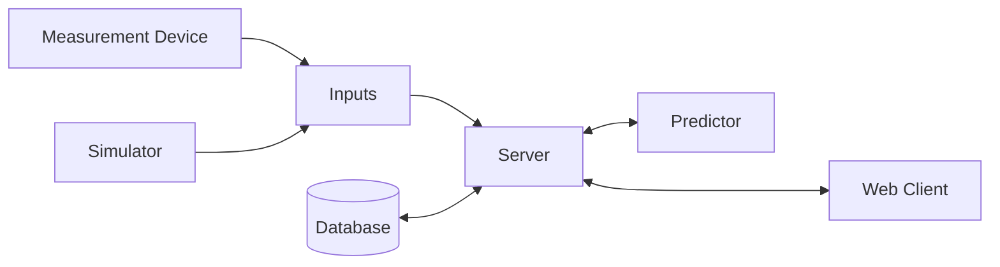

# Temperature Server

## Overview

This Server receives measurements from a cooking thermometer with two probes. One measures the temperature of the oven and the other one the core temperature of the meat. The measurements are shown on a webpage and the remaining time is predicted until the core reaches a specified temperature.

## Data Flow

