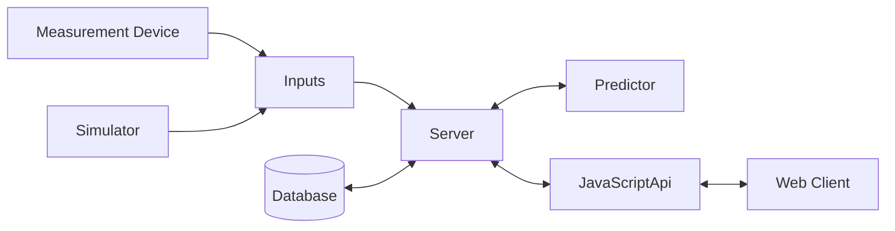

# Temperature Server

## Overview

This Server receives measurements from a cooking thermometer with two probes. One measures the temperature of the oven and the other one the core temperature of the meat. The measurements are shown on a webpage and the remaining time is predicted until the core reaches a specified temperature.

## Data Flow



## Inputs

This section explains how measurement data can be sent to the server.

### HTTP-POST

Measurements can be sent via a HTTP/POST message. The messages needs to have the following format.

```
Measurement,device=TempSens,Sensor=<name> value=<val> <ts>
```

where:

```
<name> is the number of the sensor (1 or 2).
<val> is the measured value as float.
<ts> is the timestamp in ns since epoch.
```

The timestamp is optional. If no timestamp is given the time at which the message arrives is used.
After each Measurement a newline indicates a new Measurement. So measurements for two sensors can be sent together.

## API

It is possible to connect to the Server via a SocketIO api. A brief documentation can be found [here][temperatur_server.api]. More information may follow.
